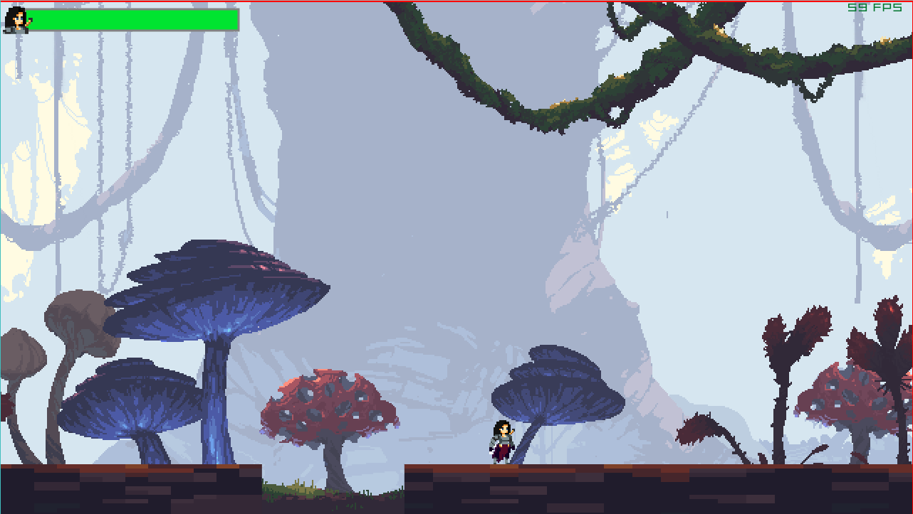

# Platformer Game Using Raylib

A 2D platformer game built with **Raylib** and can be compiled for **Linux**, **Windows**, and **Webassembly**.
This is a simple project, where I compiled the C code with clang for wasm without using emscripten, Inspired by  
[Tsoding's zozlib](https://github.com/tsoding/zozlib.js) The idea is to [Program in C for WebAssembly without using Emscripten](https://surma.dev/things/c-to-webassembly/).

Tt's a fun personal project of mine to try and make my **Raylib Game** work on web without needing to use Emscripten and Create my own raylib.js for using raylib with wasm [check my gamelib](https://github.com/3manuel0/gamelib), it was a big learning experiance to try and implement the Raylib functions in **javascript** myself and Understand how **WASM32** works with javascript.

Feel free to use my gamelib it's available separately in [raylib.js](https://github.com/3manuel0/gamelib).

### Created Using:

  
  
  
   

### [Play The Game on web](https://3manuel0.github.io/2dPlatformerGame/)

# Licenses:

######

## My Game's license:

You are free to view and explore the code.  
Copying, modifying, distributing, or using it in any form is strictly prohibited without the explicit permission of the author.

© 2025 3manuel0

## Raylib License:

This project uses Raylib, a C library for game programming, licensed under the zlib/libpng license.

For more information, see: [Raylib Website](https://www.raylib.com)

## Fantasy Swamp Forest Assets License:

### License Terms (Free Version):

1. You can **build upon** a part of the Assets or use it in any **commercial or non-commercial** project.

2. You can **publish** related to Assets, school projects, educational purposes, and similar uses.

3. **You cannot modify** the Assets.

4. The Asset pack **cannot be resold or redistributed**, even if modified.

5. **Credit is appreciated** but not required.

For more information, you can visit:

- [The Flavare Official Website](https://theflavare.com/)

- [Fantasy Swamp Forest on Itch.io](https://theflavare.itch.io/forest-nature-fantasy-tileset)

- [The Flavare on Twitter](https://twitter.com/TheFlavare)

## Warrior Asset License:

### License Terms

The following asset(s) are used in this project:

- Warrior-Free Animation set V1.3

- Terms:

- You can use this asset for personal and commercial purposes.

- You can modify this asset as needed.

- Attribution is not required but appreciated.

- You **cannot** redistribute or resell the asset.

For more information, see:

- [Clembod's Twitter](https://x.com/Clembod)

- [Clembod's Itch.io](https://clembod.itch.io)

- [Warrior Asset in Itch.io](https://clembod.itch.io/warrior-free-animation-set)
